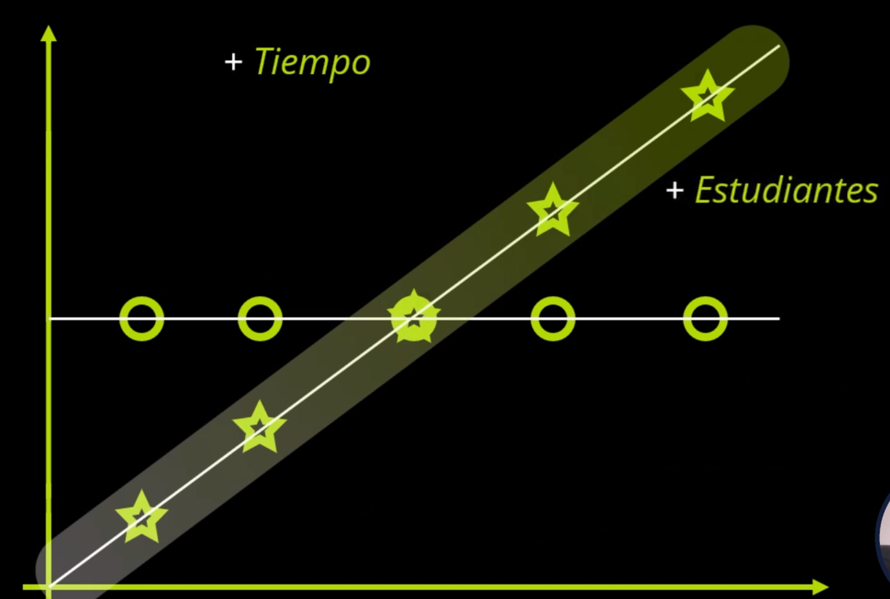
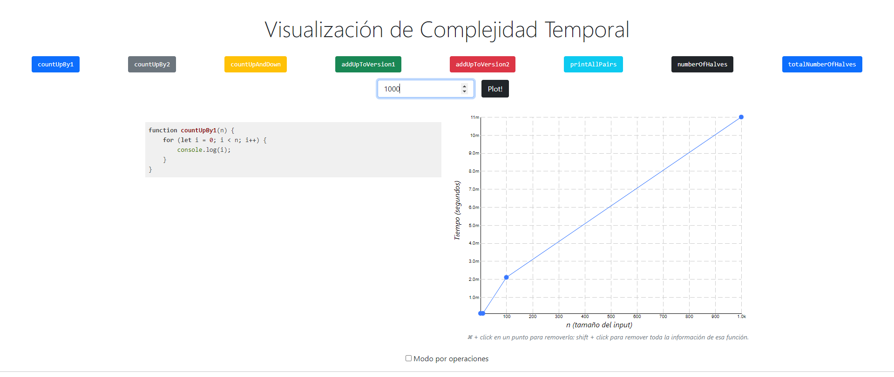
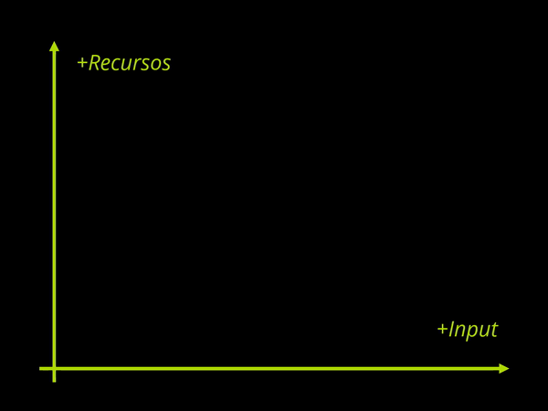
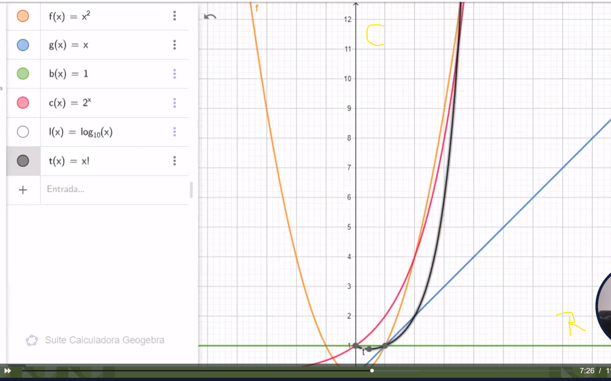

# Complejidad Algoritmica Js.

¿Cómo sabemos cuando un coche es más rápido que otro? Bueno, si los ponemos en un tramo igual, y tomamos nuestros relojes para medir cuánto tardan, podremos ver que uno llega más rápido que otro a la meta 🏁. Que un coche tarda menos que otro. Tal vez unos 10, o 20, o 30 minutos.

Entonces, medir es clave para determinar el mejor. Pero la Complejidad en sí no trata de si un coche llega 10, o 20 o 30 minutos más rápido a la meta. Si no del ritmo con el que aumenta. Esto lo veremos en todo el módulo de Complejidad Algorítmica.

La teoría de la complejidad estudia el consumo de recursos (tiempo, espacio) que un algoritmo ocupa. la complejidad algorítmica no se fija en el tiempo de ejecución del algoritmo (segundos, minutos, horas, etc), se fija en el ritmo y que tan eficiente puede ser un algoritmo en base al problema que está resolviendo. 🤓

### **La complejida** no se trata de cuando mas o menos se tarda sino como aumenta en el tiempo

##### Complejidad temporal: cuanto se demora un algoritmo en terminar.

La complejidad temporal se puede definir como la relación de crecimiento entre datos de entrada y tiempo de ejecución

 **RESUMEN:** La complejidad temporal trata de medir la eficiencia de un algoritmo conforme la cantidad de datos de entrada va aumentando.

La complejidad temporal trata de medir un algoritmo según su tiempo

Su medición no se basa en medir totalmente un caso, sino medir el tiempo conforme va creciendo la cantidad de entradas

Su objetivo es revisar cuanto aumenta el tiempo a medida que crecen sus entradas

La complejidad temporal debe ser independiente

De la máquina

Del lenguaje de programación

Del compilador

De cualquier otro elemento hardware o software que influya en el análisis





[Tool](https://radiant-anchorage-11930.herokuapp.com/)

##### Complejidad espacial: cuanta memoria operativa (RAM usualmente) es requerida por el algoritmo.

La medida del tiempo tiene que ser independiente:
– de la máquina
– del lenguaje de programación
– del compilador
– de cualquier otro elemento hardware o software que influya en el análisis.

https://radiant-anchorage-11930.herokuapp.com/

Para poder medir la complejidad temporal en JavaScript existen dos maneras populares de realizar estas medidas

> Interfaz performance

El método performance.now() nos ayuda a medir el tiempo entre dos líneas de código en milisegundos

Existe otro método: console.time() pero no es tan preciso como performance.now()
Cabe aclarar que el tiempo de ejecución de un algoritmo es normal que varíe conforme vayamos midiendo en diferentes momentos

📌 RESUMEN: Para poder medir la complejidad temporal podemos realizarlo mediante performance.time() o por console.time(). Las mediciones normalmente varían cuando probamos un algoritmo

```
https://nodejs.org/api/perf_hooks.html#perf_hooks_performance_now

https://w3c.github.io/hr-time/#dom-performance-now

Graficador de complejidad:
https://radiant-anchorage-11930.herokuapp.com/
```

#### Complejidad espacial:

La complejidad espacial, se encarga de calcular cuanto espacio en memoria puede ocupar un algoritmo, a parte del espacio ocupado por los datos de entrada, existe el espacio auxiliar, el cual es el espacio creado por el mismo algoritmo para hacer otro procesos, por ejemplo: filtrar un array, hacer un sort de números, etc. El espacio auxiliar incluso puede llegar a hacer mucho más grande que el espacio de los datos de entrada, y está relacionado al algoritmo mas que a los datos recibos.

#####  Memoria

Cuando trabajamos con grandes cantidades de datos tendremos que almacenar información en otras partes.

##### Espacio auxiliar
La complejidad espacial incluye el espacio auxiliar y el espacio ocupado por los datos de entrada.

El espacio auxiliar es el espacio total - espacio datos de entrada

Los pasos realizados dentro del algoritmo, pueden ser operaciones que creen más espacio (como crear una lista donde ir dejando los resultados de un algoritmo de ordenamiento).

El espacio auxiliar es más importante que los datos de entrada.

```
Complejidad espacial

Necesitamos un algoritmo, que ocupe poco espacio. Esta situación se nos puede dar cuando trabajamos con grandes cantidades de datos los cuales tendremos que almacenar información en otras partes

La complejidad espacial se separa en dos partes
 - Espacio ocupado por datos de entrada

 - Espacio auxiliar ⇒ (espacio total - espacio por los datos de entrada)

Muchas veces existen algoritmos que ocupan mucho espacio (ejm. Creando muchas estructuras de datos)

El espacio auxiliar es más importante que el espacio de datos de entrada debido a que estos no cambian su tamaño

📌 **RESUMEN:**  La complejidad espacial trata de medir el espacio que ocupa un algoritmo dividiendo tanto en espacio por los datos de entrada y el espacio auxiliar el cual es el espacio total ocupado por el algoritmo menos el espacio de los datos de entrada
```


#### Cuando nos referimos a Espacio Auxiliar,

```js
function plusOne(arr){
  const result = arr.map(item => item + 1)
  return result;
}
```

Estamos hablando del espacio usado dentro del proceso. En el caso de arriba, se esta creando un nuevo array al momento de usar map, ya que este método es inmutable, lo que crea un array nuevo, en lugar de modificar el pasado como parámetro. Este nuevo array que se ha creado es lo que debemos tomar en cuenta para hacer nuestro análisis Espacia

> Complejidad espacial

Ejemplo buscando un algoritmo que ocupe poco espacio Teniendo multiples algoritmos:

El algoritmo Vision realiza la operación

Con 10 datos la realiza ocupando 10 Kilobytes
Con 20 datos la realiza ocupando 20 Kilobytes
Con 30 datos la realiza ocupando 30 Kilobytes

El algoritmo Nova realiza la operación

Con 10 datos la realiza ocupando 10 Kilobytes
Con 20 datos la realiza ocupando 100 Kilobytes
Con 30 datos la realiza ocupando 1000 Kilobytes

Memoria
cuando trabajamos con grandes cantidades de datos tendremos que almacenar información en otras partes

Espacio auxiliar
La complejidad espacial el espacio auxiliar y el espacio ocupado por los datos de entrada

es más importante que el espacio de entrada, ya que el espacio auxiliar es generado por las operaciones internas que realice nuestro algoritmo. Todos los algoritmos ocupan el mismo tamaño en su entrada, pero el espacio auxiliar varía según que lógica apliquemos en el algoritmo.

Por ejemplo, el espacio auxiliar Puede ser generado por algoritmos de ordenamiento al crear nuevas variables. O las técnicas que usemos para resolver el problema, las creaciones de listas y diccionarios en el algoritmo aumentan el espacio auxiliar utilizado por el algoritmo.

[gestion_de_memoria_JavaScript](https://developer.mozilla.org/es/docs/Web/JavaScript/Memory_Management)

La complejidad espacial no es una medida de cuánta memoria utiliza un algoritmo al ejecutarse sino de cómo varía dicho consumo cuando existe una variación en la cantidad de datos de entrada. La complejidad espacial no tiene unidad, es una medida relativa.

Memoria: Cuando trabajamos con grandes cantidades de datos tendremos que almacenar información en otras partes.

Espacio auxiliar: La complejidad espacial incluye el espacio auxiliar y el espacio ocupado por los datos de entrada. El espacio auxiliar es más importante que el espacio de datos de entrada, ya que dependiendo del algoritmo se pueden llegar a crear copias de los datos de entrada, ya sea para ordenarlos, o para cualquier objetivo, y esto puede llegar a ocupar mucho espacio mientras más datos se procesen.


Sin importar el lenguaje de programación, el ciclo de memoria es casi siempre parecido al siguiente:

#### Reservar la memoria necesaria.
#### Utilizarla (lectura, escritura).
#### Liberar la memoria una vez ya no es necesaria.


### 🪀 Introducción a análisis asintótico

[analisis_asintotico](https://www.luchonet.com.ar/aed/?page_id=216)

El análisis asintótico ⇒ Es un método para describir el comportamiento limitante de una función

Análisis Asintótico es la forma con la que encontramos una función matemática similar a la medición de la complejidad.

El comportamiento asintótico de una función f(n) se refiere al crecimiento de f(n) a medida que n crece.

En el análisis asintótico, evaluamos el rendimiento de un algoritmo en términos de tamaño de entrada (no medimos el tiempo de ejecución real)
Calculamos cómo aumenta el tiempo (o espacio) que toma un algoritmo con el tamaño de entrada.

## BIG O 

☣ Somos seres precavidos. Cuando asistimos a un viaje, podemos llevar más dinero de la cuenta. Por si algo sucede mal.
Resultado de esto:

¿$150? Mejor que sean $200.

❎ Hay muchas otras notaciones, pero lo que hace a Big-O tan importante es que se destaca en concentrarse en el caso peor de tu algoritmo.
🔝 En el tope superior de nuestras mediciones. Si nuestro algoritmo empezó con unas mediciones muy buenas, pero de pronto creció mucho en el consumo de un recurso. Big-O tomará en cuenta esto último para determinar qué crecimiento le pertenece.
Resultado de esto:

¿Crecimiento constante? Mejor que sea crecimiento lineal.

Big-O no contará tanto con las mediciones pequeñas, sino con las mediciones grandes.

👁‍🗨 Mira esta animación, y fíjate cómo el cambiar los puntos superiores determina dónde se traza la línea, que nos indica un O(n).



> ¿Porque necesitamos una notación?
La queremos usar para poder simplificar el análisis de la complejidad computacional

buscamos poder simplificar la representación de la complejidad

> ¿Qué buscamos con Big-O?
Buscamos descubrir una función (constante, lineal, polinomial, logarítmica o exponencial) que sea mayor o igual que la complejidad de un algoritmo.

> Clases de Big-O
Clase	Crecimiento




Todo esto me hace concluir que los frameworks mas comunes en Javascript terminan haciendo que nuestro código consuma muchos mas recursos en memoria y en tiempo.

Por otra parte, el código en vainilla JS en ocasiones te limitan y no te permiten desarrollar los mismos productos que con los frameworks.

Entonces, qué importa mas? tu proyecto hecho en x framework que te gasta poco tiempo desarrollando pero instalaste una cantidad de código del cual solo conoces el 5% ó tu proyecto hecho en vainilla js que te gasta mucho mas tiempo en lograr el resultado pero pesa mucho menos y corre mejor…

**Es solo un comentario… no creo que haya una respuesta, habrán puntos de vista…**

Hay opiniones y decisiones que pueden valer más o menos, según tus circunstancias. Es entonces cuando pienso que la responsabilidad de nuestro criterio es importante, ya que desde este punto de vista podemos tomar las mejores decisiones para el desarrollo de nuestro proyecto.

Un framework suele ocurrir que consuman más que JS plano, pero es un peso que se suele tolerar por 2 cosas muy importantes: Mantenibilidad y Tiempo

#### Mantenibilidad porque en equipos de 100 personas escribiendo vanilla JS, es casi imposible que todos sigan un estándar de programación sin utilizar algún framework que los obligue a programar de cierta forma.

#### Tiempo el tiempo es el recurso no renovable más valioso que existe, los frameworks nos dan muchísimas herramientas que nos ayudan a entregar mejores productos más rápido.

Además, decidir entre tener una aplicación que funciona al 60% de eficiencia hecha con un framework en 1 mes VS una aplicación que funciona al 100% de eficiencia super optimizada hecha en vanilla pero tomo más de 1 año hacerla.

#### Se escogería entregar en el 1 mes con un framework porque programando es extremadamente difícil saber si tu producto o solución realmente atiende el mercado que quieres o realmente soluciona el problema planteado. por lo cual irónicamente es más importante generar un MVP que generar un buen MVP.

# Determinando la complejidad de un algoritmo más avanzado

💭 Hasta ahora hemos visto algoritmos que realizan tareas como buscar índices u ordenar elementos. Sin embargo, JavaScript ya cuenta con funciones nativas para esos propósitos.

🤔 Entonces, ¿Qué tal si determinamos la complejidad de un algoritmo más avanzado?
Un algoritmo que no esté incorporado en JavaScript, que reciba datos de una API y que tenga una estructura compleja.

🚀 Verificando un payload de SpaceX
Entonces, imagina que tú con tus amigos/as están en un reto donde desarrollan algoritmos capaces de verificar si existe un payload (una carga útil) dentro de una lista de los lanzamientos de SpaceX.

En otras palabras, este algoritmo debe recibir la lista de lanzamientos, más el ID del payload, y te devolverá true o false dependiendo si existe o no.

Cada uno de ustedes desarrolla un algoritmo diferente: Alfa, Beta y Delta, todos trabajan sobre la misma API y funcionan súper bien.

Sin embargo, cada mes se hacen muchos más lanzamientos, con más payloads, lo que significa que los datos que extraeremos de esta API empezarán a crecer. Si antes teníamos 70 payloads, el siguiente mes podríamos tener 120, y luego 200, y así.

Por ello buscamos ese algoritmo que gestione mejor el tiempo de búsqueda. 🔍

⌚ ¿Puedes encontrar cuál es? 💻

> Datos importantes
Si deseas probar los algoritmos, aquí está la API que debes declarar:

const SPACEX_API = 'https://api.spacexdata.com/v3/launches';
Pero recuerda que en el estudio de la complejidad temporal solo hacemos un análisis de línea por línea del código…

> Y si deseas probar los algoritmos:

```js

algoritmoBeta('FalconSAT-2', SPACEX_API); // true
algoritmoBeta('FalconSAT-3', SPACEX_API); // false

//Estos son los algoritmos a evaluar:

Algoritmo Alfa
async function algoritmoAlfa(payloadId, payloadAPI) {
    let respuesta = await fetch(payloadAPI);
    let data = await respuesta.json();
    for (let i = 0; i < data.length; i++) {
        let payloads = data[i].rocket.second_stage['payloads'];
        for (let j = 0; j < payloads.length; j++) {
            if (payloadId == payloads[j].payload_id) {
                return true;
            }
        }
    }
    return false;
}

// Algoritmo Beta
async function algoritmoBeta(payloadId, payloadAPI) {
    let arreglosCoinciden = (arreglo1, arreglo2) => {
        if (arreglo1.length != arreglo2.length) {
            return false;
        }
        for (let i = 0; i < arreglo1.length; i++) {
            if (arreglo1[i] != arreglo2[i]) {
                return false;
            }
        }
        return true;
    };
    let respuesta = await fetch(payloadAPI);
    let data = await respuesta.json();
    let payloadIdArray = payloadId.split('');
    for (let i = 0; i < data.length; i++) {
        let payloads = data[i].rocket.second_stage.payloads;
        for (let j = 0; j < payloads.length; j++) {
            if (arreglosCoinciden(payloadIdArray, payloads[j].payload_id.split(''))) {
                return true;
            }
        }
    }
    return false;
}

// Algoritmo Delta
async function algoritmoDelta(payloadId, payloadAPI) {
    let respuesta = await fetch(payloadAPI);
    let data = await respuesta.json();
    let listaDePayloads = [];
    let longitudData = data.length;

    for (let i = 0; i < longitudData; i++) {
        let payloads = data[i].rocket;
        listaDePayloads.push(...payloads.second_stage['payloads']);
    }

    for (let i = 0; i < listaDePayloads.length; i++) {
        let localPayloadId = listaDePayloads[i].payload_id;
        if (localPayloadId == payloadId) {
            return true;
        } else {
            return false;
        }
    }
}

```

Observaciones
❓ Interesante. Tenemos muchos ciclos for. ¿Es eso un problema?

¡Genial! Has notado que tenemos ciclos for recorriendo la lista de payloads, esto implica que la lista de payloads (representada con payloadsAPI) tiene más participación en todo el algoritmo que el otro parámetro payloadId. Por lo tanto, enfócate en qué estructuras usa payloadsAPI.

❓ Usamos async/await porque estamos manejando APIs, y APIs toman un tiempo X en cargar los datos. ¿Esto es más complejidad temporal?

Sí. Utilizar una API es la forma más común en la que el tiempo se escapa de nuestras manos (dada la estructura de JavaScript), y por ello usamos async/await. Siempre cuéntalas en tu análisis.


  - El Algoritmo Alfa tiene una complejidad temporal simplificada de O(n^2) porque tiene un ciclo for dentro de otro for.

  - El Algoritmo Beta tiene una complejidad temporal de O (n^3)

  - El Algoritmo Delta es el más eficiente temporalmente ya que a pesar de tener 2 for, estos no están anidados por lo que al calcular su complejidad estas O(n) se suman O(n) + O(n) dando como resultado O(n)

```js
/**
 * Complejidad temporal => O(n+n + n * (1 + n * (1 + 1)) + 1) = O(2n + n^2) = O(n^2)
 *
 * Complejidad Espacial => O( 1 + 1 + x^2 + x + 1 + x + 1) = O(x^2)
 * Espacio Auxiliar => O(x^2)
 *
 * @param {*} payloadId
 * @param {*} payloadAPI
 * @returns
 */
export default async function algoritmoAlfa(payloadId, payloadAPI) { // Espacial O(1), O(1)
  // temporal O(n) metodo async su tiempo es indeterminado
  // Espacial O(x^2) son matrices el nivel de complejidad del arreglo de objetos
  let respuesta = await fetch(payloadAPI); // entrada de datos?

  // temporal O(n)
  // Espacial O(x^2) son matrices el nivel de complejidad del arreglo de objetos
  let data = await respuesta.json();

  // Temporal O(n)
  // Espacial O(1)
  for (let i = 0; i < data.length; i++) {
    // Temporal O(1)
    // Espacial O(x)
    let payloads = data[i].rocket.second_stage['payloads'];

    // Temporal O(n)
    // Espacial O(1)
    for (let j = 0; j < payloads.length; j++) {
      // Temporal O(1)
      if (payloadId == payloads[j].payload_id) {
        // Temporal O(1)
        return true;
      }
    }
  }
  // Temporal O(1)
  return false;
}

/**
 * Complejidad temporal => O(n^3)
 * Complejidad espacial => O(n^2)
 * Espacio auxiliar => O(n^2)
 * @param {*} payloadId 
 * @param {*} payloadAPI 
 * @returns 
 */
export default async function algoritmoBeta(payloadId, payloadAPI) { // Espacial O(1), O(1)

  // Temporal O(1)
  // Espacial O(1)
  let arreglosCoinciden = (arreglo1, arreglo2) => {
    // Temporal O(1)
    if (arreglo1.length != arreglo2.length) {
      // Temporal O(1)
      return false;
    }
    // Temporal O(n)
    // Espacial O(1)
    for (let i = 0; i < arreglo1.length; i++) {
      // Temporal O(1)
      if (arreglo1[i] != arreglo2[i]) {
        // Temporal O(1)
        return false;
      }
    }
    // Temporal O(1)
    return true;
  };

  // Temporal O(n)
  // Espacial O(n^2) son matrices el nivel de complejidad del arreglo de objetos
  let respuesta = await fetch(payloadAPI);// entrada de datos?

  // Temporal O(n)
  // Espacial O(n^2) son matrices el nivel de complejidad del arreglo de objetos
  let data = await respuesta.json();

  // Temporal O(1)
  // Espacial O(1)
  let payloadIdArray = payloadId.split('');

  // Temporal O(n)
  // Espacial O(1)
  for (let i = 0; i < data.length; i++) {
    // Espacial O(1)
    let payloads = data[i].rocket.second_stage.payloads;
    // Temporal O(n)
    // Espacial O(1)
    for (let j = 0; j < payloads.length; j++) {
      // Temporal O(n) el metodo arreglosCoinciden es temporal O(n)
      if (arreglosCoinciden(payloadIdArray, payloads[j].payload_id.split(''))) {
        // Temporal O(1)
        return true;
      }
    }
  }
  // Temporal O(1)
  return false;
}

/**
 * Complejidad temporal => O(n + n + n + n) = O(n)
 * Complejidad Espacial => O(x^2)
 * Espacio auxiliar => O(x^2)
 * @param {*} payloadId 
 * @param {*} payloadAPI 
 * @returns 
 */
export default async function algoritmoDelta(payloadId, payloadAPI) { // Espacial O(1), O(1)

  // temporal O(n)
  // Espacial O(x^2) son matrices el nivel de complejidad del arreglo de objetos
  let respuesta = await fetch(payloadAPI); // entrada de datos?
  // temporal O(n)
  // Espacial O(x^2) son matrices el nivel de complejidad del arreglo de objetos
  let data = await respuesta.json();
  // temporal O(1)
  // espacial O(1)
  let listaDePayloads = [];
  // temporal O(1)
  let longitudData = data.length;

  // temporal O(n)
  // espacial O(1)
  for (let i = 0; i < longitudData; i++) {
    // temporal O(1)
    // espacial O(1)
    let payloads = data[i].rocket;
    // temporal O(1)
    // espacial O(n)
    listaDePayloads.push(...payloads.second_stage['payloads']);
  }

  // temporal O(n)
  // espacial O(1)
  for (let i = 0; i < listaDePayloads.length; i++) {
    // temporal O(1)
    // espacial O(1)
    let localPayloadId = listaDePayloads[i].payload_id;
    if (localPayloadId == payloadId) {
      // temporal O(1)
      return true;
    } else {
      // temporal O(1)
      return false;
    }
  }
}
```